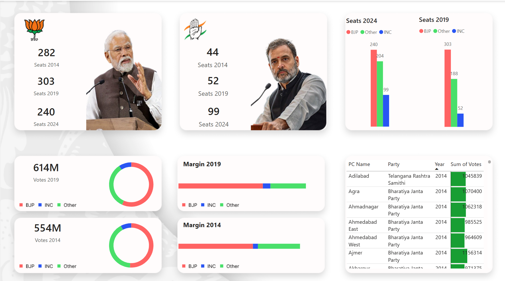

# 🗳️ Indian General Elections Dashboard (2014–2024) – Power BI Project

## 📊 Project Overview
This Power BI project presents a comprehensive visual analysis of the **Indian General Elections** held in 2014, 2019, and 2024. It compares party-wise seat distributions, vote shares, and voting margins across years, using real election data.

## 🎯 Key Features
- 🔻 Year-wise comparison of **seats won by BJP, INC, and Others** (2014, 2019, 2024)
- 🧠 Insights into **voting margins** and **vote share composition**
- 📍 Constituency-level data with vote counts and party distribution
- 📈 Trend visualizations highlighting the rise and fall of major political parties

## 🛠️ Tools & Technologies
- **Power BI Desktop**
- **DAX for Measures and Calculations**
- **Data Modeling and ETL**
- **Custom Visuals and Interactive Elements**

## 📷 Dashboard Preview
The dashboard uses interactive visuals to provide:
- Seat count comparisons (bar charts)
- Vote margins (progress bars)
- Total votes by year (doughnut charts)
- Constituency-level breakdown (table view)

## 🚀 Use Cases
- Political analysis
- Journalism and reporting
- Academic research
- Voter engagement insights

## 📥 How to Use
This project is built in Power BI. To explore:
1. Clone or download the `.pbix` file (if included).
2. Open using [Power BI Desktop](https://powerbi.microsoft.com/desktop/).
3. Interact with the visuals and explore the insights.

## 🙌 Author
**Sumit Chhillar**  
Passionate about data storytelling, political analytics, and dashboard design.  

🔗 [Connect with me on LinkedIn](https://www.linkedin.com/in/sumit-chhillar-020a36323/)
